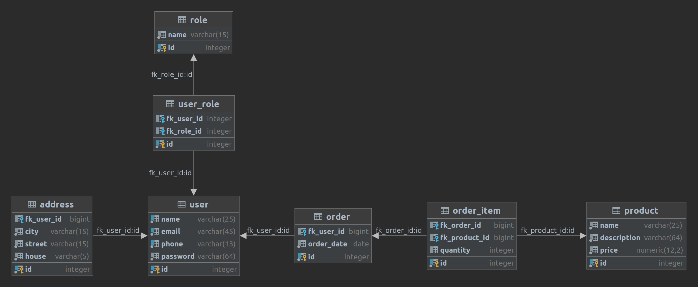
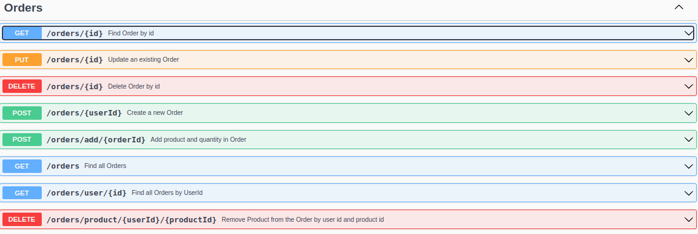

# Reactive E-Store App with PostgreSQL and Spring Data R2DBC

This project is a fully reactive application with **Spring Boot**, **Spring Webflux**, **PostgreSQL**, 
**Spring Data R2DBC** and **Flyway**.

This project tests API endpoints using a **PostgreSQL** test **Docker container**.

### Project structure

| Folder                   | Description                                                   |
|--------------------------|---------------------------------------------------------------|
| deploy                   | Contains the docker-compose.yml used to setup the application |
| src/main/java/com/estore | Spring boot application EStoreApp.java                        |

### How to build and run

In order to build the application you need to have the following software products installed:
- JDK >= 17
- Docker & Docker Compose

### Database Entity Diagram

### Exploring the Rest APIs

The server will start at <http://localhost:8080>.
You can also use the Swagger-UI to test the application.

The Swagger UI will open at : <http://localhost:8080/webjars/swagger-ui/index.html>

You can test API endpoints using a test container with a PostgreSQL database.

ProductController tests result:

OrderController tests result:

